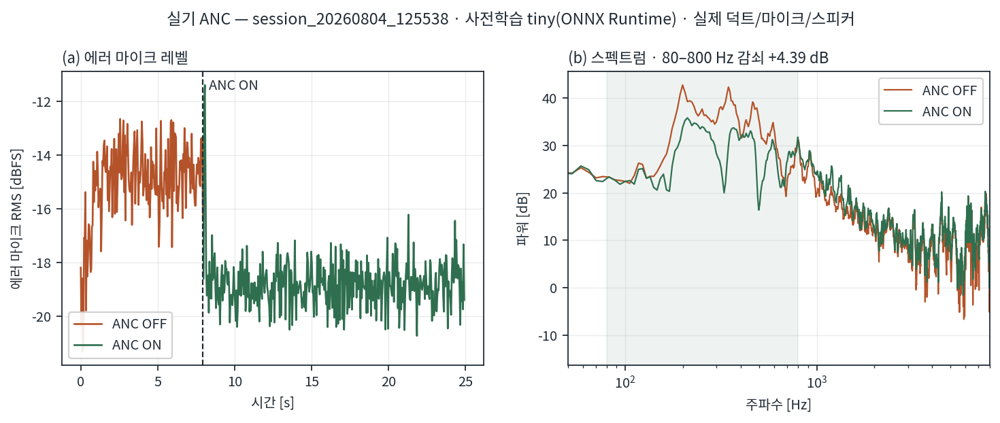
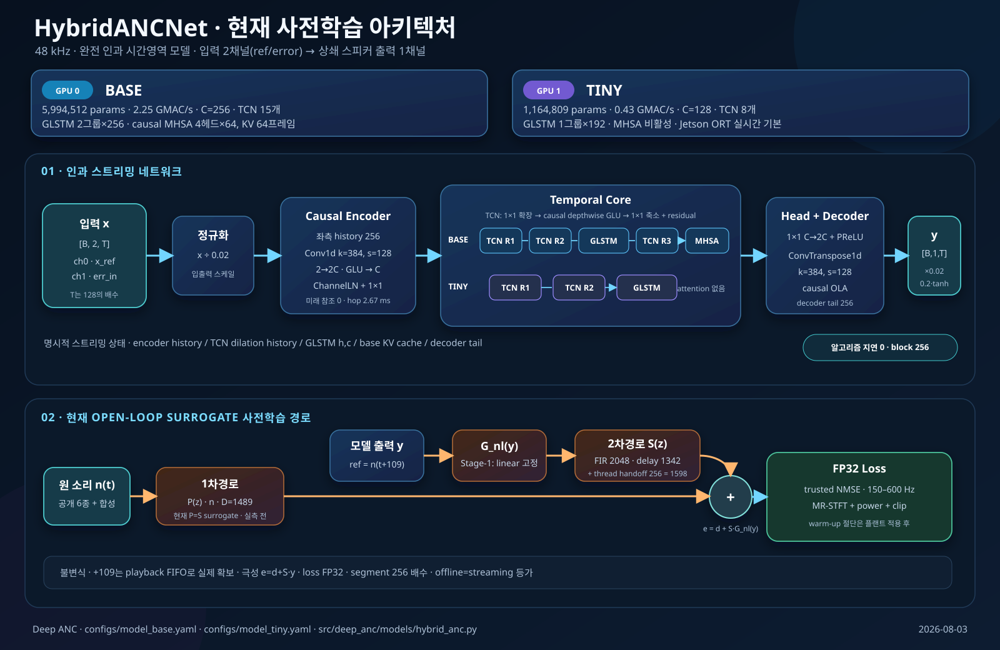
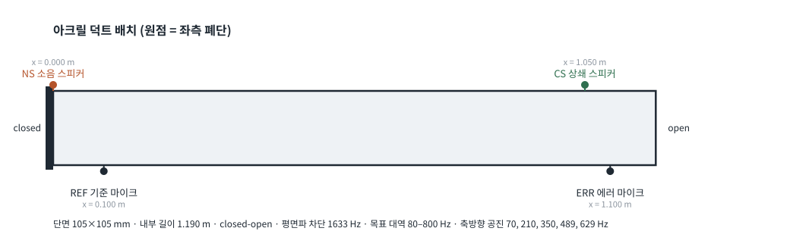
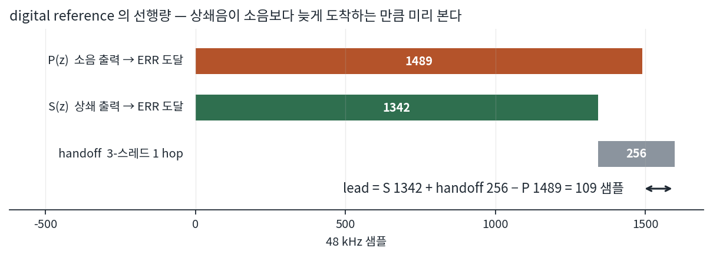
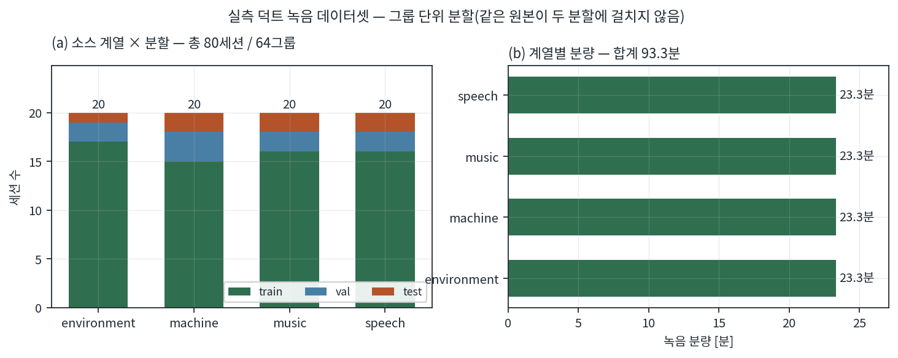

<div align="center">
  

# Deep ANC

**덕트용 인과(causal) 딥러닝 능동소음제어 — Elice A100 학습, Jetson AGX Orin 실시간 추론**

[](pyproject.toml)
[](requirements-train.txt)
[](docs/06_deployment_jetson.md)

</div>

> 1.2m 사각 아크릴 덕트 안에 quiet zone을 만든다. 48kHz 오디오를 256샘플 블록으로 받아
> **상쇄 파형을 직접 예측**하고, 학습 중에는 측정된 2차경로 `S(z)`를 미분 가능한 플랜트로
> 통과시켜 에러 마이크의 잔여 신호를 최소화한다.

진행 상황·실행 중인 학습·하드웨어 상태는 이 문서가 아니라 **[HANDOFF.md](HANDOFF.md)** 가
단일 출처다. 이 README는 프로젝트가 무엇이고 어떻게 쓰는지만 다룬다.

---

## 1. 프로젝트 개요

### 1.1 절대 목표

모든 데이터·모델·평가 결정은 다음 두 가지로 소급 판단한다.

| 목표 | 통과 기준 | 측정 축 |
|---|---|---|
| **기능 1 — 저주파와 고주파를 모두 제거** | 한쪽 대역만 좋으면 실패 | 옥타브밴드별 감쇠, 최악 10% 구간 |
| **기능 2 — 모든 소리를 제거 (quiet zone)** | 소음뿐 아니라 대화·음악도 감쇠 | 소스 종류별 감쇠의 **최악값**(평균 아님) |

기능 2가 평균이 아니라 최악값 문제인 이유: 여섯 소스 중 다섯이 −20dB이고 하나가 0dB이면
평균은 좋아 보이지만, 그 하나가 들리는 순간 quiet zone은 실패한 것이다.

판정 기준의 단일 출처는
[평가 프로토콜 §0](docs/07_evaluation_protocol.md#0-절대-목표-2가지와-측정-매핑)이다.

### 1.2 3단계 로드맵

| 단계 | 내용 | 재학습 |
|---|---|:---:|
| **Stage-1** | 합성 데이터 + surrogate 플랜트로 선형 역매핑 사전학습 | 진행 중 |
| **Stage-2** | 실측 `P(z)`/`S(z)` + recorded 세션 70%로 open-loop 파인튜닝 | 필요 |
| **Stage-3** | ERR 되먹임 closed-loop, 비선형 커리큘럼, THD/IMD 반영 | 필요 |

Stage-1이 먼저 선형 역매핑만 확립하는 이유는 [3.3](#33-학습-목표와-trusted-band)에 있다.
v1.1/v2 연구 항목은 [docs/11](docs/11_v2_roadmap.md)에 승인·기각 근거와 함께 있다.

### 1.3 검증된 것과 아직 아닌 것

| 항목 | 결과 | 상태 |
|---|---|:---:|
| 자동 회귀 테스트 | 336개 (인과성·등가성·DSP·데이터·복구 게이트) | 통과 |
| 오프라인↔스트리밍 수치 등가성 | 최대 오차 약 `3e-8` | 통과 |
| PyTorch↔ONNX Runtime 등가성 | 최대 오차 `8e-8` 이하 | 통과 |
| tiny + ORT CPU P99 | **1.84ms** / 게이트 `<3ms` | 통과 |
| tiny_long + ORT CPU P99 | **2.24ms** / 게이트 `<3ms` | 통과 |
| base + ORT CPU P99 | 6.8ms / 게이트 미달 → TensorRT 필요 | 미달 |
| 실시간 구동 (RT 우선순위 적용 후) | xrun 145 → **2** / 20초, step 1.8–2.5ms | 통과 |
| **실기 ANC 저역** (150–600Hz, tiny) | tone300 **+6.26dB** · band **+5.14dB** · 음성+소음 **+4.39dB** | 동작 |
| **실기 ANC 고역** (1150–1250Hz) | **+0.46dB** — 상쇄도 증폭도 하지 않음 | **미달** |
| recorded 독립 세션 (G2) | **80세션 / 93.3분 / 4계열 / 64그룹**, 전수 QA 80/80 | 통과 |
| `P/S` magnitude 재현성 | 반복 간 `\|H\|` 비 **1.000** | 통과 |
| `P/S` 위상·절대 지연 (G1) | 재생↔녹음 타임베이스가 1초 창 안에서 100–200샘플 warp | **실패** |
| 실제 덕트 감쇠 성능 | G1 없이는 주장하지 않는다 | **미주장** |

실기 ANC 수치는 `secondary_surrogate` checkpoint를 실기에 걸었을 때의 **관측치**다.
실측 `P/S`로 파인튜닝하기 전이므로 최종 성능이 아니다. 재현 절차와 원자료는
[6.6.3](#663-자동-offonoff-평가)과 `results/session_*/{metrics.csv, wav/}`에 있다.

고역 항목이 "미달"인 이유는 증폭해서가 아니라 **아무 일도 일어나지 않아서**다. 1200Hz는
trusted band(150–600Hz) 밖이고 학습 손실이 그 대역을 보지 않는다. 예전 기록의
"−1.50dB(증폭)"은 오독이었다 — 그 시나리오는 에너지의 0.5% 미만만 trusted band에 있어
그 숫자가 잡음이었다. 실제 1150–1250Hz 감쇠는 `+0.46dB`다.

> 추론 지연 통과는 실시간 실행 가능성을 뜻할 뿐 감쇠 성능을 뜻하지 않는다.
> 학습 로그의 NMSE는 `secondary_surrogate` 플랜트에서 나온 **표현 사전학습 지표**이며
> 물리 성능이 아니다. 이 구분은 checkpoint의 `physics_status` 필드가 강제한다.

### 1.4 실기 동작 — 소음 10초 뒤 ANC ON

<div align="center">
  
</div>

음성과 80–800Hz 덕트 소음을 섞어 재생하고 10초 뒤 ANC를 켠 실측이다. 에러 마이크 레벨이
`−14.5 → −18.7 dBFS`로 내려가고, 스펙트럼에서 150–600Hz 공진 봉우리가 눌린다. 1kHz 위는
변하지 않는다 — 손실이 그 대역을 최적화하지 않기 때문이며, **증폭하지 않는 것**이 현재의
성공 기준이다.

> 이 그림은 `results/session_*/`의 실제 WAV와 `metrics.csv`에서
> [render_readme_figures.py](scripts/docs/render_readme_figures.py)가 다시 만든다.
> 손으로 그린 그림이 아니라서 수치가 바뀌면 그림도 바뀐다.


---

## 2. 시스템 아키텍처

<div align="center">
  <a href="assets/diagrams/hybrid_anc_architecture.svg">
    
  </a>
</div>

```
        소음원 n(t)                        ┌──────────────────────────┐
            │                              │  HybridANCNet (인과)      │
            ├─ digital ref x_ref(t)=n(t+109) ▶  Encoder → TCN → GLSTM │
            │                              │  → (MHSA) → Decoder      │
            ▼                              └────────────┬─────────────┘
      P(z) 1차경로                                       │ y(t) 상쇄 파형
            │                                            ▼
            │                                      S(z) 2차경로
            └──────────▶  e(t) = d(t) + S·y(t)  ◀───────┘
                              에러 마이크 (손실 대상)
```

`HybridANCNet`은 Conv-TasNet식 학습형 encoder/decoder, WaveNet식 dilated causal TCN,
GCRN식 GLSTM을 결합한다. `base`에는 회전기계 같은 반복 패턴을 다시 보는 causal MHSA가 있고,
`tiny`는 이를 제거해 Jetson CPU 실시간 예산을 맞춘다.

### 2.1 모델 변형

| 변형 | 파라미터 | dilations | Attention | TCN 수용영역 | Jetson P99 (ORT CPU) |
|---|---:|---|---|---:|---:|
| `base` | 5,994,512 | 1,2,4,8,16 ×3 | 4head, win 64f | 504.0 ms | 6.8 ms (TRT 목표) |
| `tiny` | 1,164,809 | 1,2,4,8 ×2 | 없음 | 168.0 ms | **1.84 ms** |
| `tiny_long` | 1,301,771 | 1,2,4,8,16 ×2 | 없음 | 338.7 ms | **2.24 ms** |
| `tiny_attn` | 1,231,369 | 1,2,4,8 ×2 | 4head, win 64f | 168.0 ms | 측정 예정 |
| `tiny_long_attn` | 1,368,331 | 1,2,4,8,16 ×2 | 4head, win 64f | 338.7 ms | 측정 예정 |

tiny 계열 4종은 tiny를 원점으로 **(수용영역 축) × (조회 축)** 2×2 격자를 이룬다.
구조 비교는 NMSE 하나가 아니라 **NMSE와 Jetson P99를 함께** 본다 — 감쇠가 조금 좋아도
실시간 게이트를 넘기면 배포할 수 없기 때문이다.

### 2.2 레이어 구성

```
x [B,2,T]  (ch0=x_ref, ch1=err_in)
  │  ÷ io_scale(0.02)                       입력 정규화 — 마이크 실측 RMS 기준
  ▼
Encoder      causal Conv1d(2→2C, k=384, s=128) → GLU → ChannelLN → 1×1
  │          룩백 8ms, 룩어헤드 0. hop 128 = 2.67ms/프레임
  ▼
TCN × R      [ 1×1 → PReLU → ChannelLN
  │            → depthwise causal Conv1d(k=3, dilation=d) → PReLU → ChannelLN
  │            → (skip 1×1, residual 1×1) ]           d ∈ dilations, 반복 R회
  │          repeat 2 뒤 GLSTM, base는 repeat 3 뒤 MHSA 삽입
  ▼
GLSTM        채널을 G그룹으로 나눠 그룹별 LSTM → 그룹 간 셔플 → 결합 (GCRN)
  │          시간 상태를 프레임 간에 들고 간다 = 스트리밍 상태의 실체
  ▼
MHSA         windowed causal multi-head attention (base 전용, window 64프레임=170ms)
  │          회전기계처럼 반복하는 패턴을 되돌아본다. tiny 계열은 없음
  ▼
Decoder      1×1 → ConvTranspose1d(C→1, k=384, s=128) overlap-add
  │
  ▼  × io_scale · 소프트 리미터 0.2·tanh(y/0.2)
y [B,1,T]    상쇄 파형
```

| 하이퍼파라미터 | `base` | `tiny` | 의미 |
|---|---:|---:|---|
| encoder channels | 256 | 128 | GLU 통과 후 채널 (conv out은 2배) |
| TCN repeats × dilations | 3 × (1,2,4,8,16) | 2 × (1,2,4,8) | 수용영역을 결정 |
| TCN hidden | 512 | 256 | 1×1 확장 채널 |
| GLSTM groups × hidden | 2 × 256 | 1 × 192 | 그룹 LSTM 폭 |
| attention | 4head · 64dim · 64프레임 | 없음 | 반복 패턴 조회 |
| `io_scale` | 0.02 | 0.02 | **바꾸면 재학습 필요** |
| limiter | `0.2·tanh(y/0.2)` | 동일 | 런타임 `safety.control_limit`과 정합 |

`hop=128`인데 런타임 블록이 256인 것은 실수가 아니다. 엔진은 한 스텝에 **2프레임을 그래프
내부에서 언롤**한다. 콜백 주기를 늘려 xrun 여유를 얻으면서 알고리즘 룩어헤드는 0으로 유지한다.

`io_scale`은 마이크 실측 RMS를 기준으로 정한 상수다. 입출력 정규화가 학습된 가중치와 결합돼
있으므로 이 값을 바꾸면 checkpoint가 무효가 된다.

### 2.3 텐서 규약

| 구간 | 규약 |
|---|---|
| 입력 | `[B, 2, T]` · `ch0=x_ref`, `ch1=err_in`, `T`는 128의 배수 |
| encoder | causal Conv1d `k=384`, `stride=128` → GLU → ChannelLN/1×1 |
| 출력 | `[B, 1, T]` · `0.2·tanh(y/0.2)` 소프트 리미터 |
| 런타임 | 256샘플 블록, 내부 2프레임, 알고리즘 룩어헤드 0 |
| 1차경로 | 현재 `P(z)=S(z)` scale-matched surrogate, `D_noise=1489` |
| 2차경로 | 측정 `S(z)` 2048탭 → 순수지연 `1342+256=1598` 샘플 |

---

## 3. 덕트 구조와 동작 원리

### 3.0 덕트 물리

<div align="center">
  
</div>

| 항목 | 값 | 의미 |
|---|---|---|
| 내부 길이 | 1.190 m (외형 1.200 m) | 좌측 폐단 내측면 ~ 개구 |
| 단면 | 105 × 105 mm 사각 (PMMA, 두께 10 mm) | — |
| 경계 | closed–open | 폐단 반사 0.80, 개방단 −0.45(위상 반전) |
| **평면파 차단** | **1,633 Hz** = `c / (2·0.105)` | 이 위는 단일 스피커·단일 마이크로 제어 불가 |
| 축방향 공진 | 70 / 210 / 350 / 489 / 629 Hz | `L_eff ≈ 1.226 m` (개방단 보정 `0.61·r_eq`) |
| 현실적 목표 대역 | 80–800 Hz | 차단 주파수와 스피커 저역 한계의 교집합 |
| **trusted band** | **150–600 Hz** | 실측 `S(z)` 유효대역 ∩ 목표 대역 — 손실이 보는 유일한 대역 |

배치(원점 = 좌측 폐단): 소음 스피커 `x=0.0`(축방향 방사) · 기준 마이크 `x=0.100`(벽면) ·
상쇄 스피커 `x=1.050`(상면 side-branch, Ø40) · 에러 마이크 `x=1.100` · 개구 `x=1.200`.

> 에러 마이크의 `x=1.100`은 **잠정값**이다. 상쇄 스피커 마운트 구간(0.990–1.110)과 겹치는
> 문제가 미해결이라 확정 시 [duct.yaml](configs/duct.yaml)과 RIR 뱅크를 함께 갱신해야 한다.
> 도면과 위 표는 모두 `duct.yaml`에서 자동 생성된다 — 설정과 문서가 어긋날 수 없다.

### 3.1 지연 물리와 두 레퍼런스 모드

이 프로젝트의 심장은 지연 예산이다. 상쇄 신호는 소음보다 **먼저** 에러 마이크에 도달해야 한다.

<div align="center">
  
</div>

| 모드 | 레퍼런스 | 예측 부담 | 운용 범위 |
|---|---|---|---|
| **digital-ref** | Jetson이 소음원을 직접 생성 | 출력버퍼 지연이 양 경로에 공통 | 광대역 비정상 신호까지 상쇄 가능 |
| **acoustic-ref** | 외부 소음을 REF 마이크로 수음 | `P ≈ 30ms` 예측 필요 | 톤·회전기계·공진 등 주기/협대역 |

현재 기본은 digital-ref다. 자기 생성 소음을 실제 출력보다 앞서 공급하는 선행량이
`digital_reference_lead_samples = 109`이며 다음에서 나온다.

```
lead = (S 순수지연 1342 + 스레드 핸드오프 256) − D_noise 추정 1489 = 109
```

이 값은 checkpoint와 ONNX 메타에 기록되고, 런타임 설정이 다르면 **시작 전에 거부**한다.
acoustic 모드에서는 반드시 0으로 덮어써야 한다.

덕트 평면파 컷오프는 약 1,633Hz다. 그 이상은 단일 상쇄 스피커와 에러 마이크로 제어하기 어렵다.
acoustic-ref에서 예측 불가능한 광대역 성분은 제거가 아니라 **증폭하지 않는 0dB**가 성공 기준이다.
자세한 지연 회계는 [docs/01](docs/01_physics_limits.md)을 따른다.

### 3.2 극성과 플랜트 규약

```
e = d + S·y        (측정 FIR에 극성이 이미 포함 — 어디에서도 추가 부호 반전 금지)
```

학습 플랜트의 총지연 = `S(z)` npz의 delay(1342) + 스레드 핸드오프(256). digital-ref의
`d` 경로에는 핸드오프가 없다. RIR에는 음향 온셋이 이미 포함돼 있어서 `D_noise` 결합 시
`t_ac(NS→ERR)`를 빼야 한다([synth_dataset.py](src/deep_anc/data/synth_dataset.py) 주석 참조).

### 3.3 학습 목표와 trusted band

손실은 **trusted band에서만** 최적화한다. trusted band는 `S(z)` 실측 유효대역과 덕트
목표대역의 교집합이며 현재 **150–600Hz**다.

대역이 넓을수록 좋은 것이 아니다. `S(z)`를 신뢰할 수 없는 대역까지 fullband로 최적화하면
그 대역의 잘못된 위상 정보가 gradient를 지배해 **신뢰 구간의 성능까지 잃는다**. 실제로 초기
학습은 fullband 목표에서 loss 2.0에 수렴했는데, 그것은 "출력 0"이 정확한 해였기 때문이다.
fullband NMSE도 함께 기록하되 최적화 대상으로 삼지 않는다.

같은 이유로 Stage-1은 공칭 플랜트를 고정한다. 모델 입력에 조건으로 주어지지 않는 랜덤
delay/all-pass 섭동은 위상 gradient를 상쇄해 다시 영출력 해로 몰고 간다.
기능 1의 고역 목표를 정직하게 평가하려면 먼저 80–1600Hz 광대역 재보정을 통과해야 한다.

손실 구성: FP32 trusted NMSE + MR-STFT(256/512/1024/2048) + power + clip 정규화.
손실을 FP32로 고정하는 이유는 bf16이 FFT를 지원하지 않기 때문이다.

### 3.4 스트리밍과 ONNX 규약

- 모델은 미래 입력을 참조하지 않는다. **스트리밍 = 오프라인 수치 등가**를 테스트가 강제한다.
- 세그먼트 길이는 256의 배수. ONNX는 opset 17, 정적 shape, **상태 명시 I/O**.
- closed-loop 워밍업 절단은 플랜트 적용 **후**에 한다.

스트리밍 상태는 그래프 밖으로 드러난다 — 숨은 전역 상태를 두면 오프라인/스트리밍 등가를
검증할 수 없기 때문이다. `tiny`의 상태는 12개다.

```
st_enc                     인코더 룩백 창 (win−hop = 256 샘플)
st_0_tcn … st_7_tcn        TCN 8블록(repeats 2 × dilations 4)의 depthwise 지연선
st_8_lstm_h, st_8_lstm_c   GLSTM 은닉·셀 상태
st_dec                     디코더 overlap-add 꼬리
```

export는 이 메타(`model_name`, `digital_reference_lead_samples`, `block_samples`, `hop`,
`win`, `state_names`, 원본 `ckpt`, `ort_max_err`)를 `.json`으로 함께 쓴다. 런타임은 이 메타와
설정이 어긋나면 **오디오를 열기 전에 거부**한다.

### 3.5 실시간 3-스레드 구조

캡처 / 추론 / 재생을 SPSC 링버퍼로 잇는다. 링버퍼 소유권 규칙은 절대적이다 —
**생산자는 `write_pos`만, 소비자는 `read_pos`만** 만진다. 런타임은 항상 ANC OFF로 시작하며
`start_on=true`는 코드가 거부한다.

추론이 예산 안에 들어와도(`step` 약 1.8ms) **오디오 콜백 스레드가 일반 우선순위면 쓸 수 없다.**
그 상태에서는 20초에 xrun 145회가 났고, RT 우선순위를 준 뒤 같은 하드웨어에서 2회로 떨어졌다.
설정 방법은 [6.6.1](#661-선결-조건-오디오-스레드-실시간-우선순위)에 있다.

안전장치는 4겹이다 — 출력 소프트 리미터, 연속 클립 mute, 발산 워치독(에러파워가 베이스라인
×4로 0.5초), 추론 데드라인 워치독. **리미터 한계(`safety.control_limit`)를 모델의 실제 출력보다
낮게 잡으면 매 블록이 클립돼 ANC가 켜지자마자 mute된다.** 이것은 오작동이 아니라 설계된 동작이며,
증상은 [6.7 문제 해결](#67-문제-해결)에 있다.

### 3.6 GPU 작업 큐

학습이 끝나면 GPU가 노는 구조적 문제가 있었다. 어떤 스크립트도 "작업 완료 → 다음 작업 투입"
체인을 갖지 않았고, 한 작업이 실패하면 남은 작업이 전부 취소됐다. Elice는 인스턴스 가동
시간으로 과금되므로 이 유휴가 곧 비용이다.

[`src/deep_anc/ops/job_queue.py`](src/deep_anc/ops/job_queue.py)의 감독자가 이를 대체한다.

- **기존 프로세스 불가침** — 진입은 4중 AND다. ① 자기 중복 방지 flock ② 점유 PID의
  cmdline과 `/proc/<pid>/stat` starttime을 매 폴링마다 확인(PID 재사용 함정 제거)
  ③ 기존 watcher의 lock 획득(커널이 종료 시 해제하므로 race-free 증거) ④ GPU 실제 유휴
  3회 연속. 신호는 자신이 만든 프로세스 그룹에만 보낼 수 있다.
- **실패 격리** — 어떤 작업이 실패해도 종료하지 않고 다음 작업으로 넘어간다. 종료하는 순간
  GPU가 놀기 때문이다. OOM만 **동일 하이퍼파라미터로** 1회 재시도한다(batch 자동 하향은
  실험 비교 가능성을 파괴하므로 금지). 실패 산출물은 `runs/failed/`로 옮겨 보존한다.
- **큐 재로드** — 작업 사이마다 큐 YAML을 다시 읽는다. 감독자를 재시작하지 않고 작업을 덧붙일 수 있다.

---

## 4. 기술 스택

| 영역 | 구성 |
|---|---|
| 학습 | Elice Cloud 2×A100 80GB, PyTorch 2.5.1+cu121, bf16 AMP, AdamW + warmup→cosine |
| 추론 | Jetson AGX Orin (JetPack 6 / R36.4.4), PyTorch 2.5.0a0, **onnxruntime 1.18.1 고정** |
| 오디오 | 48kHz, 블록 256샘플, I²S 입력(APE) 2ch + USB 출력(AB13X) 2ch |
| 데이터 | DNS-Challenge, FMA-small, DEMAND, MIMII, ESC-50 + 합성 신호 (약 154.9시간) |
| 평가 | trusted/fullband NMSE, 옥타브밴드, 소스별, held-out 비선형(η=0.15) |

> `onnxruntime`은 **1.18.1로 고정**한다. 1.19 이상은 Tegra 환경에서 크래시가 확인됐다.

### 4.1 데이터 구성

| 소스 | 유효 파일 | 비율 | 담당 분포 |
|---|---:|---:|---|
| 합성 신호 | on-the-fly | 25% | 톤, 고조파, AM/FM, 협대역, chirp |
| DNS noise | 16,000 | 30% | 광범위한 실환경 소음 |
| DNS speech | 8,065 | 15% | 대화·음성 — **기능 2** |
| FMA-small | 7,997 | 10% | 음악 — **기능 2** |
| DEMAND | 96 | 8% | 주방·세탁기·사무실·지하철·차량 |
| MIMII fan | 3,600 | 7% | 저역 회전기계음 |
| ESC-50 | 2,000 | 5% | 비정상 환경·이벤트음 |

음성·음악이 분포에 포함된 것은 우연이 아니라 기능 2의 요구다. digital-ref 모드는 광대역
비정상 신호도 인과적으로 상쇄할 수 있기 때문에 가능하다.

이 규모는 **범용 사전학습을 시작하기에는 충분하지만 최종 모델의 완성 조건은 아니다.**
실측 `P(z)`, 80–1600Hz `S(z)` 재보정, 소스·대역별 검증에 따른 혼합비 조정,
digital/acoustic 모드별 별도 학습이 추가로 필요하다.

내장 val은 고정 16개라 최종 판정용이 아니다. 공개 데이터의 파일 단위 split에는 동일 화자·책·
환경·기계 조건의 상관 누수 가능성이 남아 있어 `best.pt`만 신뢰하지 않고 `last.pt`도 함께 본다.

### 4.2 실측 덕트 녹음 데이터셋 (파인튜닝용)

합성 데이터만으로는 실제 덕트의 공진·비선형·마이크 특성을 배울 수 없다. Stage-2 파인튜닝은
**실제 덕트에서 스피커를 울려 녹음한 세션**을 70% 비율로 섞는다.

<div align="center">
  
</div>

| 항목 | 값 |
|---|---|
| 세션 / 분량 | **80세션 · 93.3분** (게이트 요구: `≥80` **그리고** `≥90분`) |
| 소스 계열 | speech / music / environment / machine — 각 20세션 · 23.3분 |
| 그룹 | 64그룹 — 같은 원본(화자·앨범·기계 등)이 두 분할에 걸치지 않게 묶는다 |
| 분할 | train 64 / val 9 / test 7 (**그룹 단위**) |
| 채널 | ERR(ch0) + REF(ch1) 2채널 `mics.wav` + 재생한 `source.wav` |
| 재생 레벨 | peak 0.06 · 크레스트 10 dB로 제한 |
| QA | 전수 80/80 PASS — 클리핑 0%, ERR RMS 하한, xrun 발생 세션은 **저장 자체를 거부** |

수집 과정에서 실제로 걸러낸 것들이 이 설계의 이유다.

- **크레스트 제한이 없으면 세션이 통째로 무의미해진다.** ESC-50 클립을 피크 정규화만 하면
  크레스트가 27 dB까지 올라가 RMS가 0.0026이 되고, 마이크에는 소음 바닥과 구분되지 않는
  신호가 들어온다(구동/무구동 차이 `+0.3 dB`). tanh 소프트 클리핑으로 10 dB로 맞춘 뒤
  SNR이 `+19.4 dB`가 됐다.
- **그룹 깊이를 자동으로 고르지 않으면 분할이 무너진다.** LibriSpeech를 그대로 쓰면 20개
  speech 세션이 전부 `group=dev-clean` 하나가 되어 speech 전체가 한 분할로 몰린다.
- **xrun이 난 세션은 재시도한다.** 배치의 첫 세션은 full-duplex 스트림을 처음 여는 순간이라
  거의 항상 한 번 걸린다. 한 번 재시도하고, 두 번 연속 실패하면 결함으로 기록한다.

```bash
.venv/bin/python scripts/data/build_recording_sources.py     # 계열별 소스 WAV 생성
.venv/bin/python scripts/data/record_session_batch.py --confirm-speaker   # 연속 녹음(스피커)
.venv/bin/python scripts/data/make_recorded_manifest.py      # 그룹 단위 분할
.venv/bin/python scripts/data/validate_recorded_sessions.py  # 전수 QA
```

---

## 5. 프로젝트 구조

```
Deep_ANC/
├── configs/              # 모델·데이터·덕트·학습·런타임 설정 (단일 출처)
│   ├── duct.yaml         #   S(z)/핸드오프/목표대역 — 여기서만 정의한다
│   ├── model_*.yaml      #   base, tiny, tiny_long, tiny_attn, tiny_long_attn
│   ├── runtime_tiny.yaml #   배포 후보 실기 설정 (tiny + ORT, lead 109)
│   └── elice/            #   GPU 작업 큐 정의
├── src/deep_anc/
│   ├── models/           # HybridANCNet (TCN / GLSTM / MHSA)
│   ├── data/             # 합성·recorded 데이터셋, manifest, 전수 QA, P(z) resolver
│   ├── dsp/              # 동시 인터리브 자극 설계, warp 추적/역보정
│   ├── losses/           # trusted-band NMSE + MR-STFT + power/clip 정규화
│   ├── train/            # Trainer, checkpoint, 파인튜닝 readiness 게이트, lock
│   ├── eval/             # 지표, 플롯, recorded 독립 평가
│   ├── realtime/         # 3-스레드 런타임, 엔진 4종, SPSC 링버퍼
│   └── ops/              # GPU 작업 큐 감독자 (학습 경로와 분리)
├── scripts/
│   ├── elice/            # 부트스트랩, 병렬 학습, 구조 탐색, 작업 큐
│   ├── train/            # 학습, ONNX export, 파인튜닝 진입 감사·파이프라인
│   ├── eval/             # 오프라인 평가, FxLMS 비교
│   ├── bench/            # 입력 preflight, 지연·전달맵 측정
│   ├── data/             # 노이즈풀, RIR 뱅크, P/S 측정(ESS·동시 인터리브), 덕트 녹음
│   ├── demo/             # 세션 평가(OFF→ON→OFF), 청취용 데모 렌더링
│   ├── docs/             # README 그림 생성 (실측 산출물에서 재생성)
│   └── jetson/, export/  # Jetson 유저공간 셋업, TensorRT 엔진 빌드
├── assets/               # 다이어그램, 이미지, 버전 관리하는 측정 자산
├── tests/                # 회귀 테스트 336개
└── docs/                 # 00~11 + FxLMS 부록
```

실행 중 생성되는 `data/`, `runs/`, `results/`, `transfer/`는 `.gitignore`의
**루트 앵커(`/`)** 로 차단된다. 앵커를 빼면 `src/deep_anc/data/`와 `scripts/data/`까지
무시되는 사고가 난다(실제 이력).

### 5.1 문서 지도

| 범주 | 문서 |
|---|---|
| 시작·현황 | [HANDOFF](HANDOFF.md) · [전체 개요](docs/00_overview.md) · [작업 규칙](AGENTS.md) |
| 물리·실물 | [지연 물리](docs/01_physics_limits.md) · [하드웨어](docs/02_hardware_setup.md) · [덕트 구조](docs/09_duct_structure.md) |
| 데이터·모델 | [데이터 파이프라인](docs/03_data_pipeline.md) · [모델 아키텍처](docs/04_model_architecture.md) · [구조 지도](docs/10_structure_map.md) |
| 학습·배포 | [Elice 학습](docs/05_training_elice.md) · [Jetson 배포](docs/06_deployment_jetson.md) · [개발 절차](docs/08_dev_workflow.md) |
| 평가·연구 | [평가 프로토콜](docs/07_evaluation_protocol.md) · [v2 로드맵](docs/11_v2_roadmap.md) · [FxLMS 부록](docs/appendix_legacy_fxlms.md) |

---

## 6. 설치 및 실행

모든 Python 실행은 `.venv/bin/python`을 쓴다. 시스템 `python3`에는 torch가 없다.

### 6.1 Jetson 환경 구축 (소리 출력 없음)

```bash
git clone https://github.com/Roka-jsj/Deep-ANC.git
cd Deep-ANC

bash scripts/jetson/setup_jetson.sh    # .venv 재생성이 필요할 때만. lib preload 훅 포함 — 필수
.venv/bin/python -m pytest -q          # 268개 전부 통과해야 정상
.venv/bin/python scripts/data/build_rir_bank.py --n 300
.venv/bin/python scripts/bench/check_audio_input.py
```

### 6.2 Elice에서 사전학습 (원샷)

```bash
SSH="ssh -i ~/.ssh/elice.pem -p <포트> elicer@<호스트>"
$SSH 'git clone -q https://github.com/Roka-jsj/Deep-ANC.git; \
  setsid nohup bash Deep-ANC/scripts/elice/bootstrap_all.sh > ~/bootstrap.log 2>&1 < /dev/null &'
$SSH 'tail -n 20 ~/bootstrap.log'
```

환경 검증 → 공개 데이터 6종 다운로드 → 압축·파일목록 검증 → manifest/RIR/QA → pytest →
GPU0=base·GPU1=tiny 병렬 학습까지 자동이다. 대용량 다운로드는 `pget.py`의 병렬 Range 요청을
쓴다(Azure는 단일 연결 417KB/s로 제한되며 pget으로 약 7MB/s가 나온다).

`setsid nohup … < /dev/null &` 패턴은 선택이 아니다. 터널이 끊겨도 원격 작업은 대부분
살아 있으므로, 재실행 전에 반드시 상태를 먼저 확인한다(중복 실행 = 로그 겹쳐쓰기).

### 6.3 GPU 작업 큐

```bash
.venv/bin/python scripts/elice/job_queue.py verify --queue configs/elice/queue_gpu1.yaml
.venv/bin/python scripts/elice/job_queue.py plan   --queue configs/elice/queue_gpu1.yaml
bash scripts/elice/run_job_queue.sh 1     # 감독자 기동 (SSH 끊겨도 계속)
python3 scripts/elice/queue_status.py     # 표준 라이브러리만 사용 — 학습 CPU를 뺏지 않는다
```

`plan`과 `--dry-run`은 GPU와 기존 프로세스를 전혀 건드리지 않는다.

### 6.4 배포와 오프라인 평가

```bash
.venv/bin/python scripts/train/export_onnx.py \
  --ckpt runs/pretrain_tiny_corrected/ckpt/best.pt --out runs/export/tiny.onnx

.venv/bin/python scripts/bench/measure_inference_latency.py \
  --config configs/runtime.yaml --set engine.type=ort --set engine.onnx=runs/export/tiny.onnx

.venv/bin/python scripts/eval/evaluate_offline.py \
  --ckpt runs/pretrain_tiny_corrected/ckpt/best.pt --n-items 64
```

> DL 성능 평가는 `evaluate_offline.py`가 단일 출처다 — checkpoint의 resolved `P/S/lead`를
> 그대로 쓴다. `compare_fxlms.py`는 그 규약을 반영하지 않아 학습된 checkpoint에서 DL 감쇠를
> 약 43dB 낮게 보고하므로(실측 `+42.86 → −0.91dB`), 그런 checkpoint를 받으면 실행을 거부한다.
> FxLMS와의 실기 비교가 필요하면 [`evaluate_fxlms_direct.py`](scripts/demo/evaluate_fxlms_direct.py)를 쓴다.

ONNX 내보내기는 연속 블록 수치 등가성을 함께 검사한다.

> 오프라인 평가는 `data/manifests/`와 RIR 뱅크가 있어야 의미가 있다. 둘이 없으면 소스별
> 표에 `synthetic`만 남고 RIR이 즉석 32개로 대체되어 **기능 2를 측정할 수 없다.**

### 6.5 청취용 데모 렌더링 (소리 출력 없음)

오디오 장치를 열지 않고 상쇄 결과를 WAV로 만든다. 하드웨어 게이트와 무관하게 언제든 실행된다.

```bash
.venv/bin/python scripts/demo/render_anc_demo.py \
  --ckpt runs/pretrain_tiny_corrected/ckpt/best.pt --seconds 6
```

시나리오마다 `*_off.wav`(ANC 끔) / `*_on.wav`(ANC 켬) / `*_ab.wav`(앞 절반 OFF → 뒤 절반 ON)가
나온다. **OFF와 ON은 같은 스케일로 쓴다.** 파일별로 정규화하면 소리 크기 차이가 사라져 상쇄가
귀에서 없어진다. 물리 규약은 checkpoint에 저장된 resolved 설정을 그대로 쓴다 — 여기서 규약을
다시 구현하면 학습과 어긋난 그럴듯한 소리를 만들게 된다.

`configs/eval_demo.yaml`은 실제 음성 WAV에 덕트 소음을 섞은 시나리오다(기능 2의 청취 확인용).

> 이 소리는 **실제 덕트 성능이 아니다.** surrogate 플랜트 시뮬레이션이며, 실측 `P/S`와
> recorded 세션을 통과하기 전에는 "이만큼 조용해진다"의 근거가 될 수 없다.

### 6.6 실시간 ANC 실행 (실기 — 스피커가 울린다)

#### 6.6.1 선결 조건: 오디오 스레드 실시간 우선순위

이것이 없으면 런타임은 열리지만 **쓸 수 없다.** PortAudio 콜백 스레드가 일반 우선순위로 돌면
20초 구동에서 xrun이 145회 발생했고, 같은 하드웨어에서 RT 우선순위를 준 뒤 2회로 떨어졌다.

```bash
sudo tee /etc/security/limits.d/95-audio-rt.conf >/dev/null <<'EOF'
@audio   -  rtprio     95
@audio   -  memlock    unlimited
@audio   -  nice      -19
EOF
sudo usermod -aG audio "$USER"
sudo reboot                      # limits.conf 는 로그인 세션 시작 시에만 적용된다
```

재부팅 뒤 확인한다. `ulimit -r`이 `0`이면 아직 적용되지 않은 것이다.

```bash
ulimit -r                        # 95 여야 한다
chrt -f 80 true && echo "SCHED_FIFO 가능"
```

| 항목 | RT 우선순위 없음 | 있음 |
|---|---:|---:|
| xrun (20초 구동) | 145 | **2** |
| deadline miss | 77 | **4** |
| 추론 step | 2.6–3.2 ms | **1.8–2.5 ms** |

이것은 프로젝트 저장소 밖의 시스템 설정이므로 사용자가 직접 적용한다. Jetson의 다른 시스템
구성(RT 커널, 전원모드, pinmux)은 [8.2의 불변식](#82-불변식)대로 건드리지 않는다.

#### 6.6.2 실행

스피커를 열기 전에 입력 게이트가 먼저 통과해야 한다. 런타임이 이 검사를 내장하고 있고,
실패하면 exit 2로 스피커를 열지 않고 멈춘다.

```bash
.venv/bin/python scripts/bench/check_audio_input.py --require-both   # 사전 확인
.venv/bin/python -m deep_anc.realtime.run_realtime --config configs/runtime_tiny.yaml
```

`configs/runtime_tiny.yaml`이 배포 후보 설정이다 — `tiny` + ONNX Runtime, `lead=109`.
설정 파일 없이 덮어써서 쓸 수도 있다.

```bash
.venv/bin/python -m deep_anc.realtime.run_realtime \
  --set engine.type=ort \
  --set engine.onnx=runs/export/tiny_corrected.onnx \
  --set digital_reference_lead_samples=109 \
  --set noise.type=band --set noise.band='[80, 1000]' --set noise.amplitude=0.03 \
  --run-seconds 60 --record results/session_$(date +%m%d_%H%M).npz
```

> **`safety.control_limit`을 0.2보다 낮추지 말 것.** 0.2는 임의의 안전값이 아니라 모델 자체의
> 소프트 리미터(`0.2·tanh(y/0.2)`)와 같은 값이다. 더 낮추면 런타임 리미터가 모델을 자기
> 자신에게 클립시키고, 연속 클립 mute(20블록 = 106ms)가 ANC를 켜자마자 꺼버린다.
> 과출력 보호는 이 값이 아니라 **발산 워치독**(에러파워가 베이스라인 ×4로 0.5초 지속)이 한다.

런타임은 **항상 ANC OFF로 시작**한다. `start_on: true`는 코드가 거부한다 — 사람이 켜는 순간을
기준으로 OFF/ON을 비교할 수 있어야 하기 때문이다. 켜는 것은 키보드다.

| 키 | 동작 |
|---|---|
| `A` 또는 `Space` | **ANC ON/OFF 토글** |
| `N` | 소음 스피커 ON/OFF |
| `R` | 엔진 상태 리셋 |
| `H` | 도움말 |
| `Q` | 종료 |

`--record`는 `--run-seconds`가 있어야 한다(녹음 버퍼 크기를 미리 잡아야 하므로).
`--calibrate`는 소음을 상쇄 없이 흘려 실효 지연만 측정하는 모드다.
`--list-devices`는 오디오를 전혀 열지 않고 장치 목록만 출력한다.

#### 6.6.3 자동 OFF→ON→OFF 평가

사람이 키를 누르는 대신 프로토콜대로 진행하고 감쇠를 계산해 리포트를 쓴다.

```bash
.venv/bin/python scripts/demo/evaluate_session.py \
  --config configs/runtime_tiny.yaml --controllers dl fxlms \
  --scenarios tone300 band --out results/live_rt
```

구간은 OFF 10초 → ON 30초 → OFF 5초(`configs/eval.yaml`의 `protocol`)이며, 게이트 램프를
피하려고 경계 1–2초를 잘라내고 비교한다. `--controllers dl fxlms`로 같은 세션에서 딥러닝
컨트롤러와 FxLMS를 나란히 볼 수 있다.

#### 6.6.4 임의의 소리(음악·영상 등)를 소음원으로 쓰기

`noise.type=file`은 WAV를 소음 스피커로 재생한다. 유튜브 영상 소리로 시험하려면 먼저 WAV로
받아 두고 지정한다.

```bash
.venv/bin/python -m deep_anc.realtime.run_realtime \
  --config configs/runtime_tiny.yaml \
  --set noise.type=file --set noise.file=results/demo_source/clip.wav
```

> **재생 중인 앱 소리를 실시간으로 받아 상쇄하는 경로(`noise.type=live`)는 아직 없다.**
> digital-ref 모드는 소음원을 런타임이 직접 만든다는 전제 위에 `lead=109`를 쓰기 때문에,
> 외부 앱 출력을 받으려면 acoustic-ref(`reference: mic`, `lead=0`)로 가거나 루프백 소스를
> 새로 구현해야 한다. 현재 상태는 [HANDOFF.md](HANDOFF.md)를 따른다.

#### 6.6.5 시간축 진단

전달맵·`P/S` 측정이 INVALID로 나올 때 원인이 레벨인지 배선인지 **시간축**인지 가른다.

```bash
.venv/bin/python scripts/bench/measure_io_jitter.py --confirm-volume-minimum --seconds 30
.venv/bin/python scripts/bench/measure_duct_transfer_map.py \
  --confirm-volume-minimum --amplitude 0.02 --repeats 7 --excitation-seconds 6
```

`measure_io_jitter.py`는 연속 스트림에서 DAC→ADC 지연이 **얼마나 흔들리는지**를 본다.
ANC는 고정 위상을 전제하므로 평균 지연보다 지터가 성능을 먼저 결정한다. 두 가지가 핵심이다.

- **ERR−REF 자기검증** — 두 마이크는 같은 ADC 클록이라 상대 지연이 물리적으로 고정이다.
  따라서 ERR−REF가 흔들리면 하드웨어가 아니라 **추정기가 틀린 것**이다.
- **대역제한 PHAT** — 전대역 PHAT는 자극이 없는 대역의 잡음까지 백색화해 증폭한다.
  실제로 `−5408 샘플` 같은 값이 나왔다. 가중을 자극 대역으로 한정해야 한다.

> 이 도구의 PASS는 **유효로 인정된 주기에 대한** 판정이다. 유효 주기 수(`valid/total`)를 함께
> 보지 않으면 걸러낸 주기에 나쁜 소식이 숨는다. 전달맵이 같은 조건에서 큰 spread를 보고하면
> 지터 도구의 PASS보다 전달맵을 믿어야 한다.

### 6.7 문제 해결

| 증상 | 원인 | 대응 |
|---|---|---|
| exit 2, 스피커가 열리지 않음 | 입력 사전점검 실패 | `check_audio_input.py --require-both`. raw가 `-1`/`0` 고착이면 배선 문제이며 `--force`로 우회하지 않는다 |
| 시작 전 lead 불일치 거부 | 런타임 `digital_reference_lead_samples` ≠ checkpoint/ONNX 메타 | 설정을 메타에 맞춘다. acoustic-ref는 반드시 `0` |
| xrun·deadline miss 폭증 | 오디오 스레드 RT 우선순위 없음 | [6.6.1](#661-선결-조건-오디오-스레드-실시간-우선순위) |
| ANC를 켜도 유효구간 0% / 켜자마자 꺼짐 | `safety.control_limit` < 0.2 → 모델을 자기 리미터에 클립 | **0.2로 되돌린다** ([6.6.2](#662-실행)) |
| ANC를 켰는데 고역이 오히려 시끄러움 | surrogate 물리로 학습한 모델이 신뢰대역 밖에 잡음을 주입 | 실측 `P/S` 파인튜닝 전에는 예상된 결과다 ([7.4](#74-g1이-막혀-있는-이유--비동기-클록)) |
| 자동 mute (divergence) | 에러파워가 베이스라인 ×4를 0.5초 지속 | 설계된 보호 동작. `safety.divergence_ratio` 참조 |
| `onnxruntime` 크래시 | 1.19 이상 | **1.18.1로 고정** |

### 6.8 실측 데이터 QA와 독립 평가 (소리 출력 없음)

```bash
.venv/bin/python scripts/data/make_recorded_manifest.py
.venv/bin/python scripts/data/validate_recorded_sessions.py
.venv/bin/python scripts/eval/evaluate_recorded.py \
  --ckpt runs/finetune_tiny/ckpt/best.pt --split test
```

manifest는 같은 `group_id`를 split 밖으로 내보내지 않고 source family별 8:1:1로 나눈다.
`evaluate_recorded.py`는 checkpoint의 resolved `P/S/lead`를 그대로 써서 G4를 판정한다 —
학습 코드 경로를 재사용하면 같은 버그를 두 번 통과시키기 때문이다.

### 6.9 실측 P(z)/S(z) 측정 (실기 — 스피커가 울린다)

두 경로를 **한 번의 재생으로 동시에** 잰다. 재생(USB)과 녹음(I²S)이 다른 클록 도메인이라
두 측정이 떨어져 있으면 그 사이의 warp가 **P와 S의 상대 지연**에 그대로 실리는데,
ANC가 실제로 요구하는 값이 바로 그 상대 지연(`lead`)이다.

```bash
.venv/bin/python scripts/data/measure_paths_interleaved.py \
  --confirm-volume-minimum --dewarp        # 약 11초 재생, peak 0.02

.venv/bin/python scripts/data/calibrate_wideband.py \
  --confirm-volume-minimum --output-channel cancel   # 경로별 순차 ESS (구방식)
```

두 출력 채널에 **인접 FFT 빈을 번갈아** 실어 한 번의 FFT로 누화 없이 분리한다. 게이트가
`guard=1`을 강제하는 이유는 두 경로를 가능한 한 같은 주파수에서 보기 위해서다. 게이트를
통과한 두 NPZ는 같은 `capture_id`를 갖고, 파인튜닝 감사가 그 일치를 확인한다 — "같은 조건"을
진폭·블록·latency 값의 우연한 일치가 아니라 **같은 캡처였다는 사실**로 확인하기 위해서다.

현재 이 측정은 통과하지 못한다. 원인과 시도한 대응은 [7.4](#74-g1이-막혀-있는-이유--비동기-클록)에 있다.

### 6.10 파인튜닝 (Stage-2)

파인튜닝은 실측 `P(z)`/`S(z)`, 완료된 사전학습 checkpoint, recorded manifest가 **모두**
있어야 시작된다. 하나라도 없으면 GPU를 초기화하기 전에 거부한다.

배포 후보는 `tiny`이므로 진입점도 `tiny`를 가리킨다
(`model_tiny.yaml` / `runs/pretrain_tiny_corrected` / `runs/finetune_tiny`).
base와 동일 조건(100k step·같은 seed·같은 데이터)으로 비교했을 때 held-out trusted NMSE가
tiny 쪽이 낫고 Jetson 지연 여유도 크다.

```bash
.venv/bin/python scripts/train/run_finetune_pipeline.py \
  --config configs/train_finetune.yaml --set data.digital_primary_path_mode=measured

.venv/bin/python scripts/train/run_finetune_pipeline.py --check-only ...   # 준비 감사만
.venv/bin/python scripts/train/run_finetune_pipeline.py --status ...       # lock 없이 상태 확인
.venv/bin/python scripts/train/check_finetune.py ...                       # lock 없는 독립 감사
```

산출물은 `results/finetune_autostart/<run-key>/{status.json, audit/}`에 쌓인다.
`status.json`은 **advisory**이며 재개 판단은 항상 디스크 사실(`last.pt` 존재)로만 한다.

> **불변식:** NOT READY이면 `runs/` 아래에 아무것도 만들지 않는다. 학습 디렉터리의 존재는
> "학습이 실제로 시작됐다"는 뜻이어야 한다.

| exit | 의미 | 대응 |
|---:|---|---|
| 0 | READY 또는 전체 게이트 PASS | — |
| 1 | **NOT READY** (설계된 fail-closed) | 실측 P/S·recorded 확보 |
| 2 | config 오류, `best.pt`만 있는 모호한 재개 | 설정/체크포인트 확인 |
| 3 | 다른 경로로 이미 같은 run을 학습 중 | **조사 대상** |
| 4 | pipeline 중복 실행 | 무시 가능 (`--status`로 확인) |
| 5 | 학습/평가/완료 단계 실패 | `status.json`의 `failed_step` 확인 |

`train.py`를 직접 실행해도 같은 readiness 검사가 GPU 초기화 전에 강제된다.

---

## 7. 평가 프로토콜

성능 주장은 전체 NMSE 하나로 하지 않는다. 소스별, 저·고역별, 중앙값과 최악 10%,
실시간 P99/xrun을 함께 통과해야 한다.

### 7.1 물리 게이트 G1–G4

| 게이트 | 내용 | 현재 |
|---|---|:---:|
| **G1** | 같은 게인의 실측 `S(z)`(cancel→ERR)와 `P(z)`(noise→ERR). `repeats≥3`, 반복 일관성 `≥0.9`, `amplitude≤0.02`, 대역 80–1600Hz, xrun/clip 0, 반복 지연 spread `≤1ms` | **실패** |
| **G2** | recorded 독립 세션 `≥80`개 / `≥90`분 / 4개 source family, 전수 QA 통과 | 통과 |
| **G3** | 파인튜닝 설정 정합 — measured 모드, recorded 비율, lead 일치 | 통과 |
| **G4** | recorded val/test 독립 평가. **checkpoint SHA와 manifest SHA에 결박**, 소스별 **최악값**이 기준 | 대기 |

G1을 통과하지 못한 상태에서 나온 어떤 감쇠 수치도 **진단값**이지 성능이 아니다.
성공한 반복만 골라 고정 `P/S`로 저장하는 방식으로 게이트를 우회하지 않는다.

G4가 소스별 **평균이 아니라 최악값**을 보는 이유는 기능 2의 정의 그 자체다. 평균 게이트는
"음성을 6dB 증폭하지만 나머지를 잘 잡는" 모델을 통과시킨다 — quiet zone은 그 순간 실패다.

### 7.4 G1이 막혀 있는 이유 — 비동기 클록

파인튜닝을 막고 있는 유일한 블로커다. 원인이 확정돼 있으므로 기록해 둔다.

재생은 USB DAC(AB13X), 녹음은 Tegra APE I²S다. **서로 다른 클록 도메인**이라 "출력 샘플
번호 ↔ 녹음 샘플 번호" 대응이 시간에 따라 흔들린다(warp). 2026-08-04 동시 인터리브 측정이
그 크기를 처음으로 정확히 재었다.

| 관측 | 값 | 뜻 |
|---|---|---|
| 톤 SNR 중앙값 | **29.5 / 29.9 dB** | 레벨·음향·마이크는 정상이다 |
| 자극 대역 내 에너지 | 97.4% · 대역 밖 대비 35.5 dB | 신호는 제대로 실려 있다 |
| 반복 간 `\|H\|` 비 | **1.000** | 크기 응답은 완벽히 재현된다 |
| 주기 간 위상 (직선 적합 잔차) | **1.8–3.9 rad** | 순수 시간이동조차 **아니다** |
| 1초 창 안에서의 대응 이동 | **100–200 샘플** | 정수주기 FFT 가정이 깨진다 |

레벨 가설은 직접 반증됐다 — 진폭을 4배 올려도 개선이 없었다. 깨진 것은 시간축 하나다.

시도한 것과 결과:

| 접근 | 반복 일관성 (요구 0.9) |
|---|---:|
| 순차 ESS (경로마다 따로 측정) | 0.08–0.17 |
| 동시 인터리브, 보정 없음 | 0.05 |
| 동시 인터리브 + warp 추적/역보정 (창 43ms) | **0.84 / 0.85** |
| 동시 인터리브 + warp 추적 + 궤적 평활 | 0.54 (악화) |

평활이 **악화**시킨다는 사실이 중요하다. ±150 샘플의 요동은 추적 잡음이 아니라 실제
타임베이스 거동이다. 현재 최선인 0.85는 게이트 0.90에 못 미치며, **게이트를 낮추지 않는다.**

```bash
.venv/bin/python scripts/data/measure_paths_interleaved.py --confirm-volume-minimum --dewarp
```

동시 측정이 옳은 방향이라는 근거는 남아 있다: 두 출력 채널은 같은 DAC·같은 스트림을 지나므로
warp가 공통으로 실리고, 실제로 두 경로의 지연이 함께 움직이는 것이 관측된다. 그리고 실기
ANC가 `+6dB`로 동작하는 이유도 같다 — 소음과 상쇄음이 같은 스트림을 지나 `e = d + S·y`에서
warp가 상쇄되기 때문이다. 설계는 [interleaved_probe.py](src/deep_anc/dsp/interleaved_probe.py)에,
시뮬레이션 검증은 [test_interleaved_probe.py](tests/test_interleaved_probe.py)에 있다.

측정이 통과하면 `duct.yaml`의 `primary_path_npz`/`d_noise_delay_samples`와 `lead`를 갱신하고
`check_finetune.py`가 READY로 바뀐다. 그 전에는 Stage-2를 시작하지 않는다.

### 7.2 오프라인 평가 산출물

`evaluate_offline.py`는 절대 목표 2가지를 분리 측정한다.

- **기능 1** — 옥타브밴드별 감쇠 (trusted 대역 표시 포함)
- **기능 2** — 소스 종류별 NMSE (synthetic / dns / speech / music / demand / machine / esc50)
- trusted−fullband 간극, held-out 비선형(η=0.15) 일반화, 아이템 분포(중앙값·최악)

`metrics.npz`의 `per_item_trusted_db`는 후보 간 **paired 비교**의 근거다. 모든 후보가 같은
평가 seed로 동일한 아이템을 보기 때문에 아이템 난이도 분산이 상쇄된다.

### 7.3 구조 후보 선정 규칙 (사전 등록)

결과를 보기 **전에** 큐 정의에 확정한다. 결과를 본 뒤 기준을 바꾸는 것을 구조적으로 막는다.

1. **1차 지표** — `last.pt`의 held-out trusted NMSE. `best.pt`는 고정 16개 val 배치에서
   뽑혀 선택 편향이 있고, `last.pt`는 모든 후보가 같은 step 예산이라 편향이 없다.
2. **유의성** — 대조군 대비 paired 차이의 bootstrap 95% CI 상한 `< −0.30dB`.
   유의한 후보가 없으면 **승자는 대조군**(가장 싸고 P99 위험이 낮다).
3. **실격** — fullband 또는 held-out이 대조군 대비 `1.0dB` 초과 악화(do-no-harm),
   `config_snapshot.yaml` 지문 불일치, step 예산 불일치.
4. **동점(0.30dB 이내)** — ① 최악 소스가 가장 좋은 후보(기능 2) ② trusted 밴드 중 감쇠 `≤0`인
   밴드가 적은 후보(기능 1) ③ 비용 순.
5. `best.pt`로 확인했을 때 승자가 다르면 `winner_ambiguous` — 자동 승격하지 않는다.

> 이 신뢰구간은 평가 아이템 간 분산만 덮고 **run 간(seed) 분산은 덮지 않는다.**
> seed 반복 결과가 나오기 전에는 확정적 우열 주장으로 쓰지 않는다.

---

## 8. 안전 및 정책

### 8.1 스피커를 여는 스크립트

`record_duct`, `record_session_batch`, `calibrate_wideband`, `measure_paths_interleaved`,
`measure_duct_transfer_map`, `measure_channel_paths`, `measure_io_jitter`, `measure_io_latency`,
`playback_duct_probe`, `evaluate_session`, `evaluate_fxlms_direct`, `run_realtime`은 실제 소리를 낸다.
**사용자가 현장에 있고 앰프 볼륨이 최저인 상태에서만** 실행한다.

측정 스크립트는 `--confirm-volume-minimum` 없이는 실행되지 않고 진폭 상한(`0.02`)이 코드에 있다.
소리를 내지 않는 대안은 [6.5의 WAV 렌더링](#65-청취용-데모-렌더링-소리-출력-없음)이다.

실행 전에 스피커를 전혀 열지 않는 입력 게이트가 먼저 통과해야 한다.

```bash
.venv/bin/python scripts/bench/check_audio_input.py                 # ERR ch0 (FxLMS/digital-ref)
.venv/bin/python scripts/bench/check_audio_input.py --require-both  # ERR+REF (recorded/acoustic-ref)
```

장치가 열려도 raw가 `-1`/`0`으로 고착되면 유효 오디오가 아니다. 이 실패를 `--force`로
우회하거나 스피커 출력으로 진단하지 않는다. 배선은
[J30 핀 표](docs/02_hardware_setup.md#j30-40핀-헤더-물리-배선-2026-08-03-사용자-확정)를 따르되,
이 문제를 해결하려고 pinmux/I²S·RT 커널·전원모드·오디오 데몬을 바꾸거나 `sudo`를 실행하지 않는다.

### 8.2 불변식

| 규칙 | 이유 |
|---|---|
| `~/anc_project`, `~/FxLMS`는 **읽기 전용** | 기존 FxLMS 실험 환경. python import도 금지(`python3 -B`) |
| Jetson **sudo·시스템 변경 금지** | 현재 구성(RT 커널, 30W, pinmux)은 의도된 것이다 |
| `S(z)`/핸드오프/목표대역은 `duct.yaml` 단일 출처 | 값이 두 곳에 있으면 반드시 갈라진다 |
| `.gitignore`의 루트 앵커 유지 | 비앵커 패턴은 소스 디렉터리까지 무시한다 |
| 비밀정보(`*.pem`, `id_rsa*`, `.env`) 커밋 금지 | 공개 저장소다 |
| TensorRT는 사전 구성된 환경에서만 | 이 프로젝트를 위해 `apt`/`sudo` 설치를 하지 않는다 |
| 지연·극성·인과성·SPSC 소유권·FP32 손실·정적 ONNX 상태 I/O | 테스트가 강제하는 불변식 |
| 파인튜닝 게이트를 낮추지 않는다 | 물리가 안 맞는데 통과시키면 그 뒤 숫자가 전부 무의미해진다 |
| README 그림은 **실측 산출물에서 재생성** | 손으로 그린 그림은 시간이 지나면 조용히 거짓말이 된다 |

전체 규칙은 [AGENTS.md](AGENTS.md)가 단일 출처다.

---

## 라이선스

[MIT License](LICENSE)
